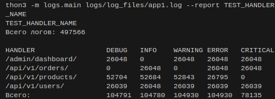

Запуск программы (из корня):

С названием отчёта:

python3 -m logs.main.py logs/log_files/app_name_1.log . . . logs/log_files/app_name_n.log --report report_name

Без названия:

python3 -m logs.main.py logs/log_files/app_name_1.log . . . logs/log_files/app_name_n.log

Запуск тестов:

pytest --cov=logs --cov-report=term-missing

Оставил в logs/log_files тестовый файл с логами.

